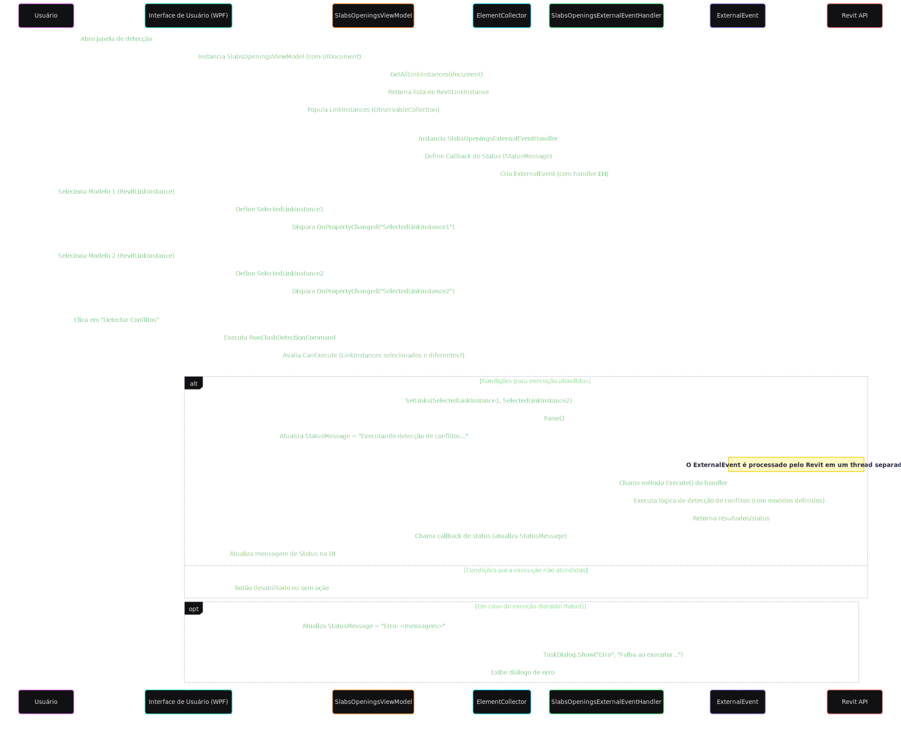

# ClashOpenings - Plugin Revit para Detecção de Conflitos e Criação Automática de Furos

Este projeto é uma biblioteca de classes desenvolvida como um plugin para o Autodesk Revit 2025. Ele utiliza a API do
Revit e o framework .NET 8 para automatizar o processo de detecção de conflitos (clash detection) entre elementos
estruturais (pisos e lajes) e elementos MEP (tubos e conduítes) em modelos vinculados. Após a detecção, o plugin gera
automaticamente furações nas lajes e pisos, garantindo a coordenação entre as disciplinas.

## Tecnologias Utilizadas

* **Revit API 2025**: Para interação direta com o ambiente e modelos do Revit.
* **.NET 8**: Framework de desenvolvimento robusto e moderno.
* **C# 13.0**: Linguagem de programação.

Este plugin não possui dependências externas, o que simplifica sua implantação e manutenção.

## Início Rápido (Quick Start)

### IDE / Building

Para instalar e preparar o plugin para uso, siga os passos abaixo:

1. **Clone o repositório** (ou obtenha os arquivos do projeto).
2. **Restaure as dependências NuGet**:
   ```bash
   dotnet restore
   ```
3. **Compile o projeto**:
   ```bash
   dotnet build
   ```

Após a compilação bem-sucedida, os arquivos de saída (DLLs e recursos necessários) serão automaticamente copiados para a
pasta padrão de plugins do Revit, tornando-o acessível na próxima vez que você iniciar o Revit.

### Instalador

Caso prefira realizar a instalação através do executável, a versão final está disponível em:
[ClashOpenings-Setup-0.1-win64.exe](https://github.com/PablloDantas/ClashOpenings/blob/560ce2b691ca48cce061b15c92f2b9194123c0f2/Release/ClashOpenings-Setup-0.1-win64.exe)

## Como Utilizar

Uma vez que o plugin esteja instalado e o Revit iniciado, siga estas instruções para utilizá-lo:

1. **Abra seu projeto no Revit** que contém os modelos vinculados (estrutural e MEP) para os quais você deseja realizar
   a detecção de conflitos.
2. **Acesse o plugin**:
    * No Revit, localize a aba ou o painel onde o plugin "Passagens BIM" está disponível.
    * Clique no botão "Inserir Passagens" do plugin para iniciar sua interface de usuário.
    * 
3. **Painel Acoplável (Dockable Panel)**:
    * Ao clicar no botão, um painel acoplável será exibido na sua área de trabalho do Revit.
    * Este painel contém dois `ComboBox` (caixas de seleção).
    * 
4. **Selecione os Vínculos**:
    * Utilize os `ComboBox` para selecionar os modelos vinculados que representam a disciplina estrutural (contendo
      pisos e lajes) e a disciplina MEP (contendo tubos e conduítes).
5. **Inicie a Detecção de Conflitos**:
    * Após selecionar os vínculos, clique no botão "Criar Passagem" (ou texto similar no botão).
6. **Processamento e Criação de Furações**:
    * O plugin executará a lógica de detecção de conflitos entre os elementos selecionados dos dois modelos.
    * Para cada conflito detectado, o plugin instanciará uma família de furação no modelo atual, nas posições corretas.
    * **Dimensionamento das Furações**:
        * A altura da furação é definida pela espessura da laje mais uma folga de 10 cm.
        * O comprimento e a largura da furação são determinados pelo diâmetro do tubo ou conduíte em conflito, mais 1 cm
          de folga.
    * **Rastreabilidade dos Dados**:
        * Para fins de rastreabilidade, os IDs dos elementos que foram analisados no clash detection (tanto do modelo
          estrutural quanto do MEP) são adicionados como parâmetros nas instâncias das furações criadas.
        * 
        * 
7. **Resumo da Execução**:
    * Ao concluir o processo, a interface do usuário exibirá um resumo informando:
        * Quantos conflitos foram encontrados.
        * Quantas furações foram instanciadas no modelo.
        * 

Este processo garante uma coordenação eficiente entre as disciplinas, reduzindo retrabalho e erros durante a fase de
construção.

## Fluxo da Aplicação / Arquitetura

### Arquitetura do Plugin: Padrão Model-View-ViewModel (MVVM)

Foi adotado o padrão de design **Model-View-ViewModel (MVVM)**. Esta escolha arquitetural visa garantir uma separação de
responsabilidades, promovendo a modularidade, manutenibilidade e a colaboração eficaz.

#### Visão Geral do Padrão MVVM

O MVVM é um padrão de arquitetura de software que estrutura a aplicação em três componentes interconectados:

1. **Model**: Representa a lógica de negócios central, as regras de validação de dados, e a interface com os serviços de
   dados e o ambiente do Revit. O Model é completamente independente da interface do usuário e encapsula as operações
   fundamentais do plugin, como a interação com a API do Revit, manipulação de elementos e persistência de dados.
2. **View**: Corresponde à interface do usuário (UI) exibida ao utilizador. No contexto deste plugin, a View compreende
   o painel acoplável () com seus controles interativos, como `ComboBoxes` e botões. A View é "passiva", refletindo o
   estado apresentado pelo ViewModel e delegando as interações do usuário (eventos) de volta ao ViewModel, geralmente
   através de data binding. `DockablePane`
3. **ViewModel**: Atua como um intermediário entre a View e o Model. Ele expõe os dados e operações do Model de uma
   forma que a View possa consumir facilmente através de mecanismos de _data binding_. O ViewModel contém a lógica de
   apresentação, gerencia o estado da View, e orquestra as chamadas para o Model em resposta às ações do usuário.
   Crucialmente, o ViewModel não possui conhecimento direto da View, permitindo que a lógica de apresentação seja
   desenvolvida e testada independentemente da UI.

#### Componentes Arquiteturais e Responsabilidades

- **Namespace: `ClashOpenings.Presentation`** Este namespace é dedicado à camada de apresentação, englobando os
  componentes `View` e `ViewModel`.
    - **`DockablePaneService.cs`**
        - **Responsabilidade**: Esta classe é fundamental para a integração da interface do usuário do plugin com o
          ambiente do Revit. Ela é encarregada de gerenciar o ciclo de vida do painel acoplável (), incluindo sua
          criação, registro junto à API do Revit e controle de visibilidade. A `DockablePaneService` atua como um _host_
          para a `View` do plugin, garantindo que a interface seja corretamente exibida e funcional dentro da aplicação
          Revit. No contexto MVVM, ela facilita a "montagem" da `View` no ambiente hospedeiro. `DockablePane`

- **Namespace: `ClashOpenings.Services`** Este namespace contém a lógica de negócios principal do plugin, representando
  a camada **Model**.
    - **`ClashDetective.cs`**
        - **Responsabilidade**: Esta é a classe central para a funcionalidade de detecção de conflitos (
          `Clash Detection`). Suas responsabilidades abrangem:
            - Aquisição e processamento de dados de elementos (pisos, lajes, tubos, conduítes) de modelos vinculados no
              Revit.
            - Implementação de algoritmos de detecção de interferências entre elementos estruturais e MEP.
            - Cálculo preciso das transformações geométricas e dimensões necessárias para as aberturas (furações) com
              base nos conflitos identificados. A presença de métodos como `CalculateClashTransforms` (que retorna
              `(Transform transform1, Transform transform2, Transform transform2To1)`) sublinha seu papel na manipulação
              e análise de dados geométricos.
            - Orquestração da criação de instâncias de famílias de furação no modelo do Revit, incluindo a definição de
              seus parâmetros (altura, largura, comprimento) e a atribuição de IDs de rastreabilidade para os elementos
              em conflito.

        - **Papel no MVVM**: Atua como um componente vital do **Model**, provendo as operações de negócios e manipulação
          de dados que são invocadas pelo `ViewModel` para executar a funcionalidade primária do plugin.

#### Componentes Implícitos na Estrutura MVVM

Além das classes explicitamente mencionadas, a arquitetura MVVM implica a existência de outros componentes essenciais:

- **Views (Arquivos XAML)**: Espera-se a presença de arquivos XAML (ex: `MainView.xaml` ou `ClashPanel.xaml`) dentro do
  namespace `ClashOpenings.Presentation`. Estes arquivos são responsáveis por definir a estrutura visual da interface do
  usuário do painel acoplável, incluindo os controles interativos e elementos de exibição de resultados.
- **ViewModels (Classes C#)**: Complementando as Views, haverá classes C# correspondentes (ex: `MainViewModel.cs` ou
  `ClashPanelViewModel.cs`) também no namespace `ClashOpenings.Presentation`. Estas classes expõem as propriedades
  observáveis para _data binding_ com a View (e.g., listas de modelos vinculados, status da execução) e implementam os
  comandos que a View pode acionar (e.g., o comando para iniciar a detecção de conflitos). O `ViewModel` interage com o
  `ClashDetective` e outros serviços do `Model` para realizar as operações e atualizar o estado da `View`.

Em suma, a adesão ao padrão MVVM e a clara segregação de responsabilidades entre as camadas `Presentation` e `Services`
capacitam o plugin ClashOpenings com uma base arquitetural sólida. Esta estrutura não só otimiza a legibilidade e a
manutenibilidade do código, mas também facilita o desenvolvimento e a evolução contínua das funcionalidades do plugin.



## Créditos

Muito obrigado ao Ricaun por disponibilizar projetos de exemplo para se trabalhar com dockable panels, a maior parte dos 
serviços para integração, cadastro e inicialização dos painéis do Revit foram feitas usando os recursos disponíveis nos repositórios:
* [ricaun.Revit.UI.Dockable](https://github.com/ricaun-io/RevitAddin.Dockable.Example)
* [RevitAddin.Dockable.Example](https://github.com/ricaun-io/RevitAddin.Dockable.Example)
